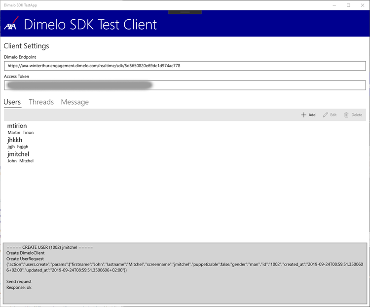
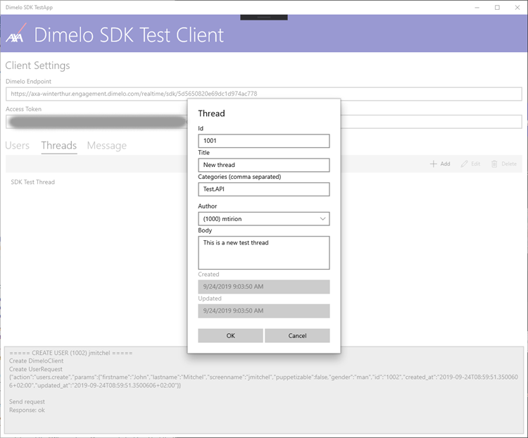
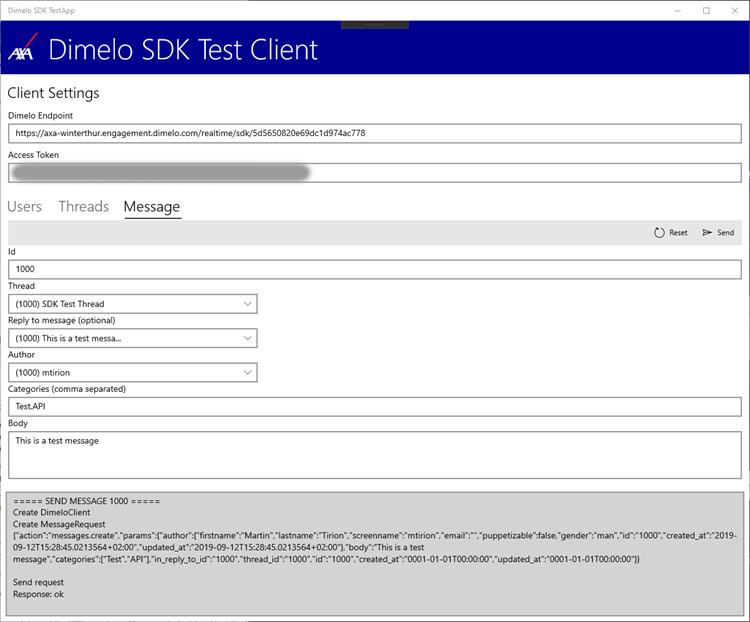

# Dimelo SDK for C#
Dimelo provides a REST API to make calls. There is also a prescribed way to get callbacks from Dimelo, where you must register an endpoint that implements specific messages with a defined data-structure.

To create an easy SDK to be used to call into the Dimelo REST API, we first investigated the API. We decided to focus on the first easy steps to implement:
 1.	Create a user
 2.	Create a thread
 3.	Create a message

All calls to the REST API use a specific header attribute to sign the message. A SHA512 hash needs to be made using the body of the message and an account token provided by Dimelo per customer.

The architecture of the SDK is to create an instance of the DimeloClient class. This takes the Dimelo REST API endpoint and the account token as parameters. To send data to the API you create a DimeloRequest. The request contains a few general fields, one of them being a Parameter. We created subclasses for specific parameters like a User, Thread and Message. By creating these specific types and assigning them to the Parameter field the request is set up. The Send message of the DimeloClient is used to send the request to the API.

One problem we encountered was the use of the Format field in requests. According to the documentation this could be set to “text” or “html” to indicate the type of the body. The API however gave an error on any of these values. So, for the hack we just out commented that field and not push it into the API.

To make sure we can validate the SDK we created some test methods in a separate project. The main structure of the SDK is tested through these tests.

For the implementation of the SDK we setup a CI process to build and test the SDK. Every commit or PR results in a build where the tests are run.
To have an easy way to test the SDK with custom data we also created a Test Application. With this application you can create a user, a thread and send a message. 
 

The interface offers the possibility to enter the endpoint and account token, which are stored in the memory of the app for next runs. There is also a local cache of items that were created. There is no implementation to retrieve this data from the Dimelo API. The bottom of the app shows a log window with the result of an action, including the JSON that was send to the API.
 

For ‘User and Thread’ a dialog pops up to enter the data. On OK the data is sent to the API.
 

The Send Message part of the app lets you select a user and a thread and even a previous message (all from the local cache!) to send a message. 

>>>>>>>>>>>>>> https://engage-api-docs.readthedocs.io/en/latest/

https://github.com/ringcentral/engage-digital-source-sdk/wiki/Send-API

PHP
https://github.com/ringcentral/engage-digital-source-sdk
GO
https://grokify.github.io/go-ringcentral-engage/
JS
https://github.com/ringcentral/engage-digital-source-sdk-js

# Autorest
npm install -g autorest@beta
autorest --reset
https://raw.githubusercontent.com/grokify/go-ringcentral-engage/master/codegen/openapi-spec_v3.0.0.json

autorest --input-file=.\openapi-spec_v3.0.0.json --csharp --output-folder=src\ --namespace=Dimelo

autorest --input-file=https://raw.githubusercontent.com/grokify/go-ringcentral-engage/master/codegen/openapi-spec_v3.0.0.json --output-folder=.\src\generated --csharp

# java

# codegen
curl http://central.maven.org/maven2/io/swagger/swagger-codegen-cli/2.4.9/swagger-codegen-cli-2.4.9.jar -o swagger-codegen-cli.jar
java -jar swagger-codegen-cli.jar help
java -jar swagger-codegen-cli.jar generate -i https://raw.githubusercontent.com/grokify/go-ringcentral-engage/master/codegen/openapi-spec_v3.0.0.json -o .\src\generated-codegen -l csharp-dotnet2 

java -jar swagger-codegen-cli.jar generate -i docs\openapi-spec_v3.0.0.json -o .\src\generated-codegen -l csharp-dotnet2 

# openapi-generator
curl http://central.maven.org/maven2/org/openapitools/openapi-generator-cli/4.1.3/openapi-generator-cli-4.1.3.jar -o openapi-generator-cli.jar 

java -jar openapi-generator-cli.jar generate -i https://raw.githubusercontent.com/grokify/go-ringcentral-engage/master/codegen/openapi-spec_v3.0.0.json -g csharp-netcore -o .\src\generated-openapi

java -jar openapi-generator-cli.jar config-help -g csharp-netcore

csharp
csharp-netcore

# NSwag
https://github.com/RicoSuter/NSwag/wiki/CommandLine